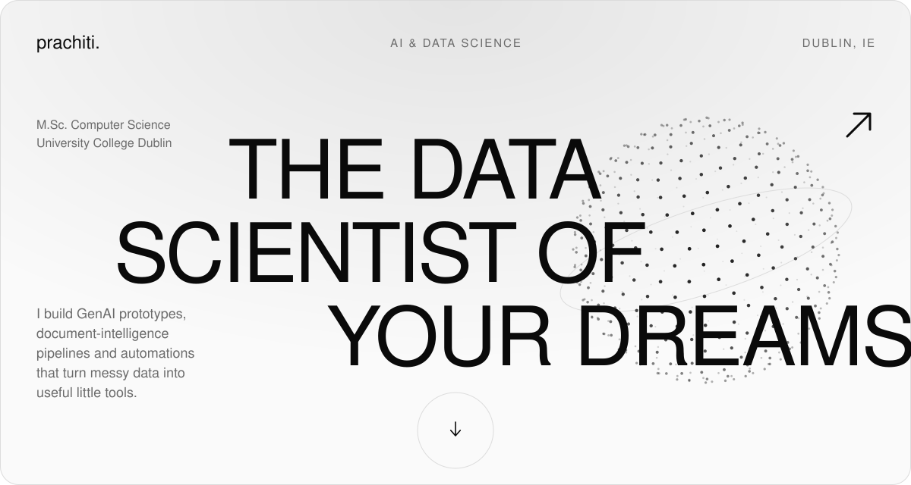
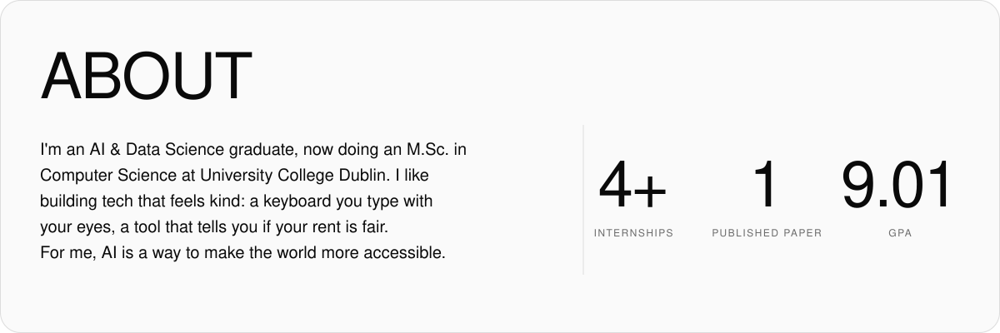
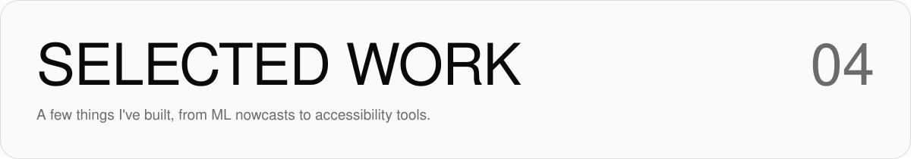
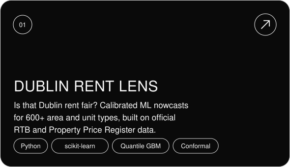
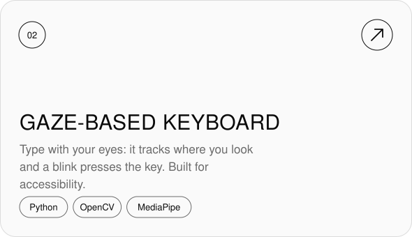
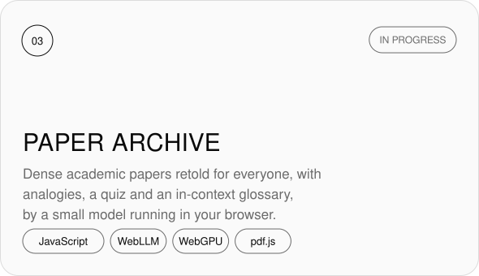
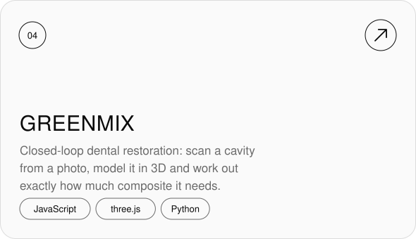
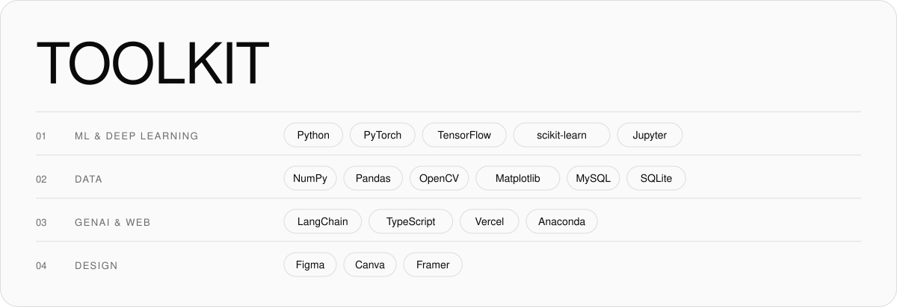
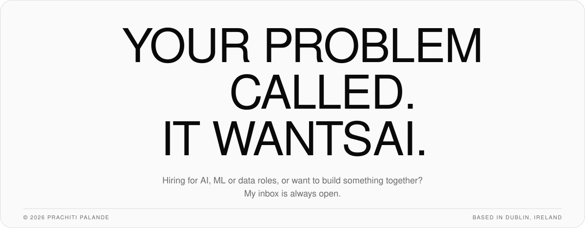

<!-- Every section is an SVG made by assets/build.py, in a dark and a light version.
     To change the text: edit assets/build.py, run `python3 assets/build.py`, commit. -->

<picture><source media="(prefers-color-scheme: dark)" srcset="assets/dark/hero.svg"></picture>
<picture><source media="(prefers-color-scheme: dark)" srcset="assets/dark/about.svg"></picture>
<picture><source media="(prefers-color-scheme: dark)" srcset="assets/dark/work.svg"></picture>

<a href="https://ppalande1903.github.io/dublin-rent-lens/"><picture><source media="(prefers-color-scheme: dark)" srcset="assets/dark/card-dublin-rent-lens.svg"></picture></a> <a href="https://github.com/ppalande1903/virtualkeyboard"><picture><source media="(prefers-color-scheme: dark)" srcset="assets/dark/card-gaze-keyboard.svg"></picture></a>
<picture><source media="(prefers-color-scheme: dark)" srcset="assets/dark/card-paper-archive.svg"></picture> <a href="https://greenmix-eight.vercel.app"><picture><source media="(prefers-color-scheme: dark)" srcset="assets/dark/card-greenmix.svg"></picture></a>

<a href="https://github.com/ppalande1903?tab=repositories"><picture><source media="(prefers-color-scheme: dark)" srcset="assets/dark/more.svg"></picture></a>

<picture><source media="(prefers-color-scheme: dark)" srcset="assets/dark/toolkit.svg"></picture>
<picture><source media="(prefers-color-scheme: dark)" srcset="https://streak-stats.demolab.com?user=ppalande1903&border_radius=24&card_width=1200&hide_border=false&background=0a0a0a&border=2a2a2a&stroke=2a2a2a&ring=f4f4f4&fire=f4f4f4&currStreakNum=f4f4f4&sideNums=f4f4f4&currStreakLabel=f4f4f4&sideLabels=8e8e8e&dates=8e8e8e"></picture>
<picture><source media="(prefers-color-scheme: dark)" srcset="assets/dark/contact.svg"></picture>

<a href="https://ppalande1903.github.io/pixel-portfolio/"><picture><source media="(prefers-color-scheme: dark)" srcset="assets/dark/btn-portfolio.svg"></picture></a>
<a href="https://www.linkedin.com/in/prachiti-palande-947842284"><picture><source media="(prefers-color-scheme: dark)" srcset="assets/dark/btn-linkedin.svg"></picture></a>
<a href="mailto:prachitipalande191@gmail.com"><picture><source media="(prefers-color-scheme: dark)" srcset="assets/dark/btn-email.svg"></picture></a>
<a href="https://instagram.com/palandeprachiti"><picture><source media="(prefers-color-scheme: dark)" srcset="assets/dark/btn-instagram.svg"></picture></a>

